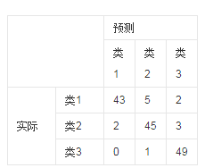

# 混淆矩阵（Confusion Matrix

混淆矩阵的每一列代表了预测类别，每一列的总数表示预测为该类别的数据的数目；
每一行代表了数据的真实归属类别，每一行的数据总数表示该类别的数据实例的数目。
每一列中的数值表示真实数据被预测为该类的数目：如下图，
第一行第一列中的43表示有43个实际归属第一类的实例被预测为第一类，
同理，第二行第一列的2表示有2个实际归属为第二类的实例被错误预测为第一类。

如有150个样本数据，这些数据分成3类，每类50个。

分类结束后得到的混淆矩阵为：

每一行之和为50，表示50个样本，
第一行说明类1的50个样本有43个分类正确，5个错分为类2，2个错分为类3

> 

有时，我们可能希望得到分类器算法的更详细的性能。
能够详细揭示性能的一种可视化方法是引入一个称为混淆矩阵（confusion matrix）的表格。
混淆矩阵的行代表测试样本的真实类别，而列代表分类器所预测出的类别。

它之所以名为混淆矩阵，是因为很容易通过这个矩阵看清楚算法产生混淆的地方。

下面以女运动员分类为例来展示这个矩阵。

假设我们有一个由100名女子体操运动员、100名WNBA篮球运动员及100名女子马拉松运动员的属性构成的数据集。

我们利用10折交叉验证法对分类器进行评估。在10折交叉测试中，每个实例正好只被测试过一次。

上述测试的结果可能如下面的混淆矩阵所示：
 
|体操运动员|篮球运动员|马拉松运动员|
|-------|------|------|
|体操运动员|83|0|17|
|篮球运动员|0|92|8|
|马拉松运动员|9|16|85|

同前面一样，每一行代表实例实际属于的类别，每一列代表的是分类器预测的类别。

因此，上述表格表明，有83个体操运动员被正确分类，但是却有17个被错分为马拉松运动员。

92个篮球运动员被正确分类，但是却有8个被错分为马拉松运动员。

85名马拉松运动员被正确分类，但是却有8个人被错分为体操运动员，还有16个人被错分为篮球运动员。

混淆矩阵的对角线给出了正确分类的实例数目。
 
||体操运动员|篮球运动员|马拉松运动员|
|-----|-----|-----|-----|
|体操运动员|83|0|17|
|篮球运动员|0|92|8|
|马拉松运动员|9|16|85|

上述表格中，算法的精确率为：

通过观察上述矩阵很容易了解分类器的错误类型。

在本例当中，分类器在区分体操运动员和篮球运动员上表现得相当不错，而有时体操运动员和篮球运动员却会被误判为马拉松运动员，

马拉松运动员有时被误判为体操运动员或篮球运动员。